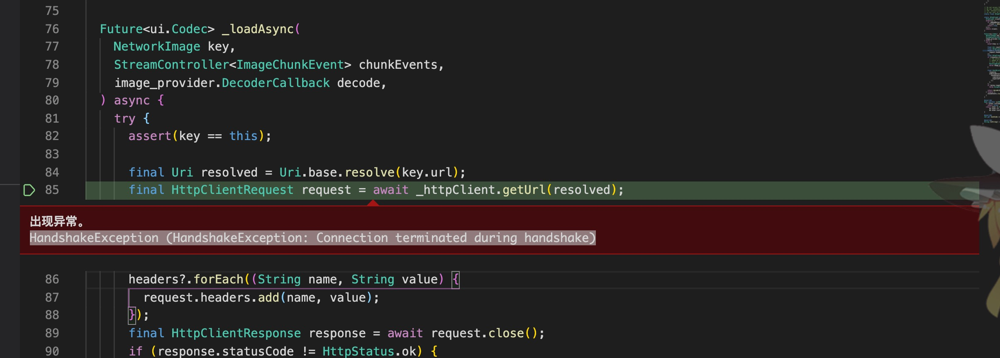
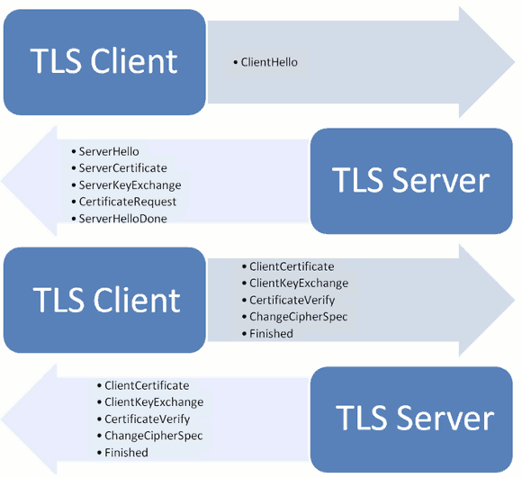

### 运行卡死在首页？
有小伙伴反馈说启动时，数据虽请求到了，但图片没加载出来，而且会出现卡死现象，稍等会会握手失败报错，Android没事，主要是iOS设备，如下图：

回顾了下tls握手建立连接的过程，如下图：

简单来说由客户端发起clienthello，然后服务端响应，然后下发证书。下发证书之后客户端要验证证书是否有效，比如是否过期之类，猜测：在客户端验证证书的过程中出现了阻塞主线程的情况，然后就导致整个应用卡住。

有了思绪就有了搜索的目标，果然碰到了不少人遇到类似问题，比如：
* https://github.com/flutterchina/dio/issues/703
* https://github.com/dart-lang/sdk/issues/41519

大概原因就是let encrypt的ocsp服务被墙掉了，导致证书校验过程非常长，或者失败。

### 解决方案
对于采用了https的服务来说，tls是会对客户端造成额外的开销的，如果通过ocsp协议进行校验是handshake阶段在线校验的，比如let encrypt的校验地址是：https://ocsp.int-x3.letsencrypt.org ，这个地址被墙掉，就会导致校验失败，或者很慢的情况。 如果服务器开启ocsp stampling服务的话，这个校验过程可以由服务端进行校验，然后直接把结果和证书一起下发给客户端。客户端就省去了这个校验工作，服务端校验有很多好处，比如nginx可以把证书校验结果在一定有效期内缓存下来，这样能大大减少证书校验时间.如：
* https://github.com/flutterchina/dio/issues/786
* https://github.com/dart-lang/sdk/issues/41519

总结就是`1.换证书 2.开启ocsp proxy`。

我尝试过修改源码的ssl认证，但可惜能力不足，未能如愿。
那么问题来了，此APP接口是抓的别人小程序，也没办法要求人家后台换证书，这问题就无解了吗？
我在测试的时候发现个方法：切换网络多次加载，不一定哪次就成功了，一但加载成功，以后就不会再遇到该问题，即使卸载重装也没问题。

很抱歉给小伙伴们带来的不便，一但找到解决方案我会第一时间更新。

