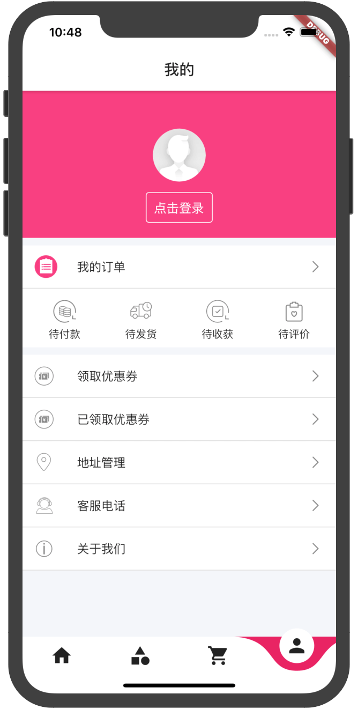

[](https://marketplace.visualstudio.com/items?itemName=Dart-Code.dart-code)
[](https://flutter.dev/docs/development/tools/sdk/releases?tab=macos#windows)

### 简介
electricity_flutter是仿照【百姓生活+】微信小程序开发的Flutter电商项目，仅供大家交流学习。

### 下载体验


### 📸 预览

|电|商|实|战|
|:---:|:---:|:---:|:---:|
|||||
|||||
|||||

### 实现模块
* [x] 首页列表
* [x] 商品详情页
* [x] 分类页
* [x] 购物车页面
* [x] 个人中心

### 版本记录
* 2023-04-04 升级flutter3.0，重构
* 2020-06-18 第一次提交

### 主要依赖
|功能|名称|版本|
|  ----  | ----  | ----  |
|  图标库  |[cupertino_icons](https://pub.flutter-io.cn/packages/cupertino_icons)|1.0.2|
|  轮播图  |[card_swiper](https://pub.flutter-io.cn/packages/card_swiper)|2.0.4|
|  网络请求  |[dio](https://pub.flutter-io.cn/packages/dio)|4.0.6|
|  适配  |[flutter_screenutil](https://pub.flutter-io.cn/packages/flutter_screenutil)|5.6.0|
|  上下拉刷新  |[pull_to_refresh_plus](https://pub.flutter-io.cn/packages/pull_to_refresh_plus)|2.0.3|
|  状态管理  |[get](https://pub.flutter-io.cn/packages/get)|4.6.5|
|  webView  |[webview_flutter](https://pub.flutter-io.cn/packages/webview_flutter)|4.0.1|
|  数据持久化  |[get_storage](https://pub.flutter-io.cn/packages/get_storage)|2.1.1|
|  调试工具  |[flutter_ume](https://pub.flutter-io.cn/packages/flutter_ume)|1.0.2+1|


### ✨使用教程
* 拉取项目：git clone [https://github.com/haolizi/electricity_flutter.git](https://github.com/haolizi/electricity_flutter.git)
* 下载插件：flutter pub get
* 诊断：flutter doctor
* 运行：flutter run
##### iOS
* 进入项目：cd ios/
* 安装依赖：pod install 或 pod update

如果出现`(Connection refused - connect(2) for "raw.githubusercontent.com" port 443)`，则表示还没设置国内源，
或者尝试下科学上网。

### 环境
................................................
最好使用和我一样的flutter版本，sdk下载地址：
https://flutter.cn/docs/development/tools/sdk/releases?tab=macos
................................................
```
flutter doctor -v
[✓] Flutter (Channel stable, 3.0.5, on macOS 12.1 21C52 darwin-arm, locale zh-Hans-CN)
    • Flutter version 3.0.5 at /Users/.../development/flutter
    • Upstream repository https://github.com/flutter/flutter.git
    • Framework revision f1875d570e (9 months ago), 2022-07-13 11:24:16 -0700
    • Engine revision e85ea0e79c
    • Dart version 2.17.6
    • DevTools version 2.12.2
    • Pub download mirror https://pub.flutter-io.cn
    • Flutter download mirror https://storage.flutter-io.cn
    
```

