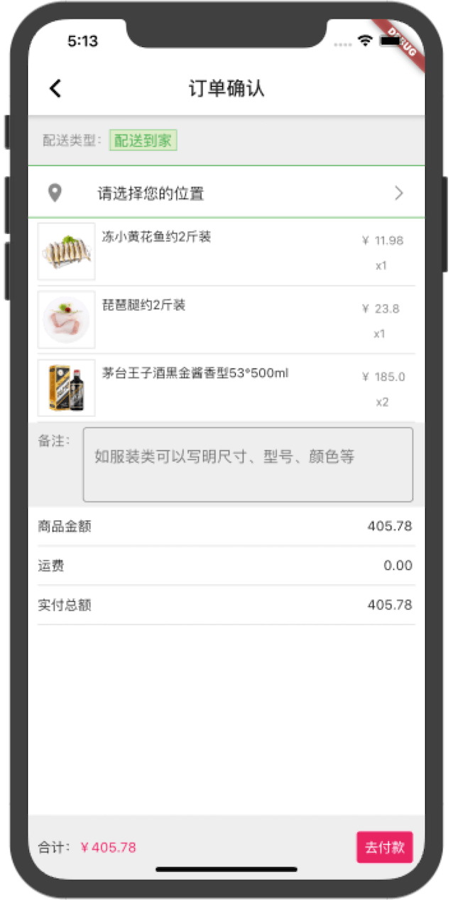

[](https://marketplace.visualstudio.com/items?itemName=Dart-Code.dart-code)
[](https://flutter.dev/docs/development/tools/sdk/releases?tab=macos#windows)
[](https://code.visualstudio.com/)

### 简介
electricity_flutter是仿照【百姓生活+】微信小程序开发的Flutter电商项目，支持安卓和iOS，仅供大家交流学习。

### 📸 预览

|电|商|实|战|
|:---:|:---:|:---:|:---:|
|||||
|||||
|||||

### 目前实现模块
* [x] 首页列表
* [x] 商品详情页
* [x] 分类页
* [x] 购物车页面
* [x] 个人中心
* [ ] 注册登录
* [x] 订单模块
* [ ] 启动页广告
* [ ] 推送
* [ ] 定位

### 更新记录
* 2020-7-04 完善订单支付页面
* 2020-6-27 优化评论列表，添加订单支付页面
* 2020-6-19 优化购物车，添加个人中心页面
* 2020-6-18 第一次提交

### 依赖
|功能|名称|版本|
|  ----  | ----  | ----  |
|  图标库  |[cupertino_icons](https://pub.flutter-io.cn/packages/cupertino_icons)|0.1.2|
|  轮播图  |[flutter_swiper](https://pub.flutter-io.cn/packages/flutter_swiper)|1.1.6|
|  网络请求  |[dio](https://pub.flutter-io.cn/packages/dio)|3.0.0|
|  适配  |[flutter_screenutil](https://pub.flutter-io.cn/packages/flutter_screenutil)|1.1.0|
|  Loading动画  |[flutter_spinkit](https://pub.flutter-io.cn/packages/flutter_spinkit)|4.1.2|
|  超文本点击  |[url_launcher](https://pub.flutter-io.cn/packages/url_launcher)|5.4.10|
|  上下拉刷新  |[flutter_easyrefresh](https://pub.flutter-io.cn/packages/flutter_easyrefresh)|2.1.1|
|  状态管理  |[provider](https://pub.flutter-io.cn/packages/provider)|4.1.3|
|  路由  |[fluro](https://pub.flutter-io.cn/packages/fluro)|1.6.3|
|  html  |[flutter_html](https://pub.flutter-io.cn/packages/flutter_html)|1.0.0|
|  数据持久化  |[shared_preferences](https://pub.flutter-io.cn/packages/shared_preferences)|0.5.7+3|

### ✨使用教程
* 拉取项目：git clone [https://github.com/haolizi/electricity_flutter.git](https://github.com/haolizi/electricity_flutter.git)
* 诊断：flutter doctor
* 运行：flutter run
##### iOS
* 进入项目：cd ios/
* 安装依赖：pod install  或 pod update

如果出现`(Connection refused - connect(2) for "raw.githubusercontent.com" port 443)`，则表示还没设置国内源，
或者尝试下科学上网。

### 我的环境
```
flutter doctor -v
[✓] Flutter (Channel stable, v1.17.5, on Mac OS X 10.14.4 18E226, locale
    zh-Hans-CN)
    • Flutter version 1.17.5 at
      /Users/qianbaiwan04/Desktop/Study/Flutter/flutter
    • Framework revision 8af6b2f038 (4 days ago), 2020-06-30 12:53:55 -0700
    • Engine revision ee76268252
    • Dart version 2.8.4


[✓] Android toolchain - develop for Android devices (Android SDK version 29.0.2)
    • Android SDK at /Users/qianbaiwan04/Library/Android/sdk
    • Platform android-29, build-tools 29.0.2
    • Java binary at: /Applications/Android
      Studio.app/Contents/jre/jdk/Contents/Home/bin/java
    • Java version OpenJDK Runtime Environment (build
      1.8.0_212-release-1586-b4-5784211)
    • All Android licenses accepted.

[✓] Xcode - develop for iOS and macOS (Xcode 11.3.1)
    • Xcode at /Applications/Xcode.app/Contents/Developer
    • Xcode 11.3.1, Build version 11C504
    • CocoaPods version 1.9.3

[✓] Android Studio (version 3.6)
    • Android Studio at /Applications/Android Studio.app/Contents
    • Flutter plugin version 47.1.1
    • Dart plugin version 192.8052
    • Java version OpenJDK Runtime Environment (build
      1.8.0_212-release-1586-b4-5784211)

[✓] VS Code (version 1.46.1)
    • VS Code at /Applications/Visual Studio Code.app/Contents
    • Flutter extension version 3.12.1

[!] Proxy Configuration
    • HTTP_PROXY is set
    ! NO_PROXY is not set

[✓] Connected device (2 available)
    • Android SDK built for x86 • emulator-5554                        •
      android-x86 • Android 10 (API 29) (emulator)
    • iPhone 11 Pro Max         • CFC51D12-F63F-422C-9E6F-740ED29004FA • ios
      • com.apple.CoreSimulator.SimRuntime.iOS-13-3 (simulator)
```

### ❓遇到问题
* [启动卡死](ISSUES.md)

#### 其他问题
* [https://flutter.dev/docs/get-started/install](https://flutter.dev/docs/get-started/install)
* [https://flutterchina.club/get-started/install](https://flutterchina.club/get-started/install)
