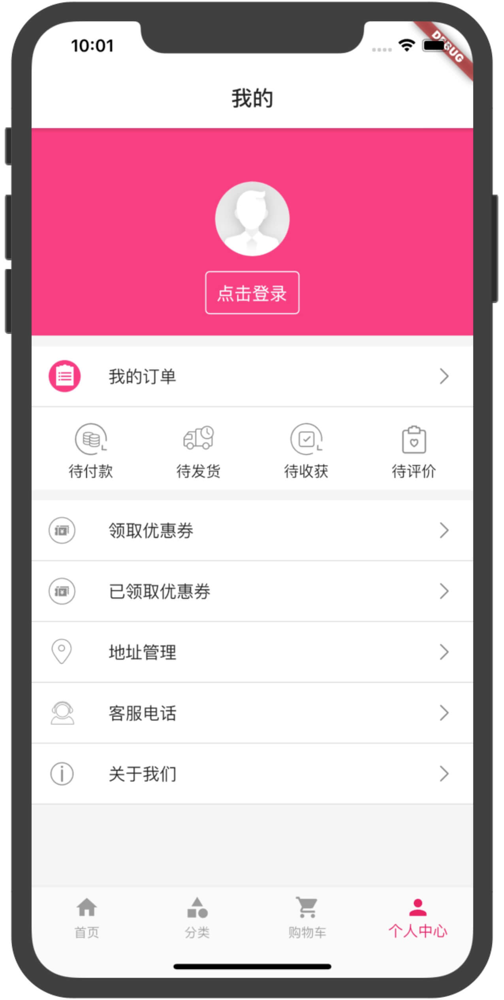

[](https://marketplace.visualstudio.com/items?itemName=Dart-Code.dart-code)
[](https://flutter.dev/docs/development/tools/sdk/releases?tab=macos#windows)
[](https://code.visualstudio.com/)

### 简介
electricity_flutter是仿照[技术胖老师](https://jspang.com/detailed?id=53)教程，稍加优化的电商项目，支持安卓和iOS，仅供大家交流学习。

### 目前实现模块
* [x] 首页列表
* [x] 商品详情页
* [x] 分类页
* [x] 购物车页面
* [x] 个人中心

### 更新记录
* 2020-6-19 优化购物车，添加个人中心页面
* 2020-6-18 第一次提交


### 📸 预览

|:---:|:---:|:---:|
||||
|||

### 依赖
* 图标：[cupertino_icons:^0.1.2](https://pub.flutter-io.cn/packages/cupertino_icons) 
* 轮播图：[flutter_swiper:^1.1.6](https://pub.flutter-io.cn/packages/flutter_swiper) 
* 网络请求：[dio:^3.0.0](https://pub.flutter-io.cn/packages/dio) 
* 适配：[flutter_screenutil:^1.1.0](https://pub.flutter-io.cn/packages/flutter_screenutil) 
* Loading动画：[flutter_spinkit:^4.1.2](https://pub.flutter-io.cn/packages/flutter_spinkit) 
* 超文本点击：[url_launcher:^5.4.10](https://pub.flutter-io.cn/packages/url_launcher) 
* 上下拉刷新：[flutter_easyrefresh:^2.1.1](https://pub.flutter-io.cn/packages/flutter_easyrefresh) 
* 状态管理：[provider:^4.1.3](https://pub.flutter-io.cn/packages/provider) 
* 路由：[fluro:^1.6.3](https://pub.flutter-io.cn/packages/fluro) 
* html：[flutter_html:^1.0.0](https://pub.flutter-io.cn/packages/flutter_html) 
* 数据持久化：[shared_preferences:^0.5.7+3](https://pub.flutter-io.cn/packages/shared_preferences) 

### ✨使用教程
* 拉取项目：git clone [https://github.com/haolizi/electricity_flutter.git](https://github.com/haolizi/electricity_flutter.git)
* 诊断：flutter doctor
* 运行：flutter run
##### iOS
* 进入项目：cd ios/
* 安装依赖：pod install  或 pod update

如果出现`(Connection refused - connect(2) for "raw.githubusercontent.com" port 443)`，则表示还没设置国内源，
或者尝试下科学上网。

### 我的环境
```
flutter doctor -v
[✓] Flutter (Channel stable, v1.17.3, on Mac OS X 10.14.4 18E226, locale
    zh-Hans-CN)
    • Flutter version 1.17.3 at
      /Users/qianbaiwan04/Desktop/Study/Flutter/flutter
    • Framework revision b041144f83 (2 weeks ago), 2020-06-04 09:26:11 -0700
    • Engine revision ee76268252
    • Dart version 2.8.4


[✓] Android toolchain - develop for Android devices (Android SDK version 29.0.2)
    • Android SDK at /Users/qianbaiwan04/Library/Android/sdk
    • Platform android-29, build-tools 29.0.2
    • Java binary at: /Applications/Android
      Studio.app/Contents/jre/jdk/Contents/Home/bin/java
    • Java version OpenJDK Runtime Environment (build
      1.8.0_212-release-1586-b4-5784211)
    • All Android licenses accepted.

[✓] Xcode - develop for iOS and macOS (Xcode 11.3.1)
    • Xcode at /Applications/Xcode.app/Contents/Developer
    • Xcode 11.3.1, Build version 11C504
    • CocoaPods version 1.9.3

[!] Android Studio (version 3.6)
    • Android Studio at /Applications/Android Studio.app/Contents
    ✗ Flutter plugin not installed; this adds Flutter specific functionality.
    ✗ Dart plugin not installed; this adds Dart specific functionality.
    • Java version OpenJDK Runtime Environment (build
      1.8.0_212-release-1586-b4-5784211)

[✓] VS Code (version 1.46.0)
    • VS Code at /Applications/Visual Studio Code.app/Contents
    • Flutter extension version 3.11.0

[!] Connected device
    ! No devices available

! Doctor found issues in 2 categories.
```
两个x是插件未安装，不用理会。

### ❗️如有问题请参考
* [https://flutter.dev/docs/get-started/install](https://flutter.dev/docs/get-started/install)
* [https://flutterchina.club/get-started/install](https://flutterchina.club/get-started/install)
